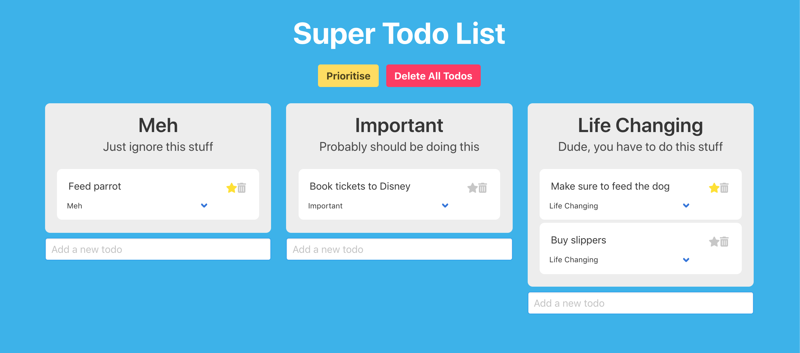

# Vue Todo App

_This is a simple Vue application that allows you to manage your tasks._



## Project setup

```
yarn install
```

### Compiles and hot-reloads for development

```
yarn run serve
```

The **Frontend Vue App** will be running on:
[localhost:8080](http://localhost:8080/ "http://localhost:8080/")

### Compiles and minifies for production

```
yarn run build
```

### Lints and fixes files

```
yarn run lint
```

## Author

#### **Alexander Jack Hughes**

[@alexjackhughes](https://twitter.com/alexjackhughes "Twitter")
